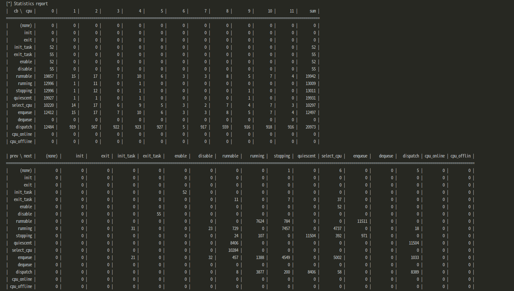

# Very Simple Task Scheduler Using SCX

This repository contains an implementation of a very simple task scheduler built with SCX. 
This repository aims to be a tutorial for implementing a scheduler using SCX.

# How to Build?

You can build the project by running the following command:

```
$ cargo build
```

Once built, the binary will be located at *target/debug/scx-rs-tutorial*. You can run the scheduler with:

```
$ sudo target/debug/scx-rs-tutorial
```

# Command Line Options

The `--stats_on` option reports callback invocation statistics.

```
$ sudo target/debug/scx-rs-tutorial --stats_on
```



# Development Guide

If you are using `clangd` as a language server, you can generate a *compile_commands.json* file with the following command:

```
$ bear -- cargo build
```
